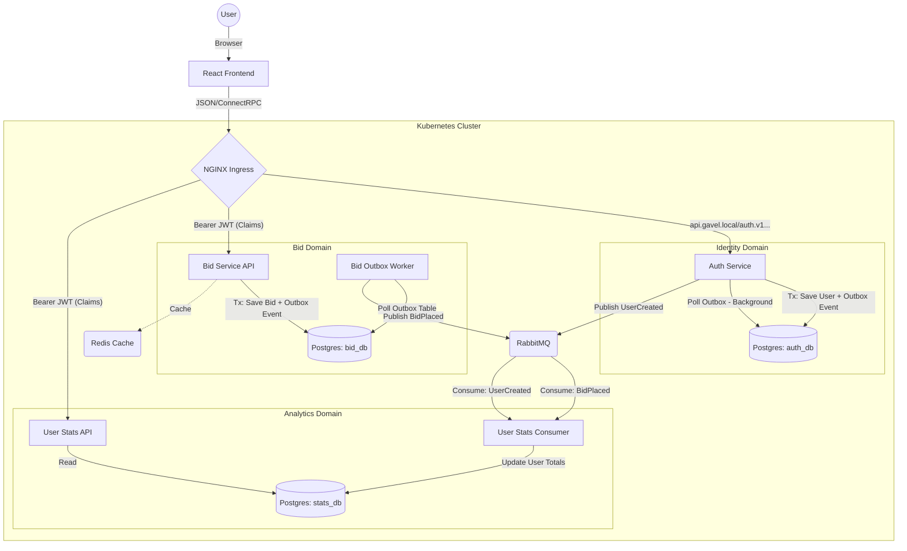

# 🔨 Gavel: High-Performance Real-Time Auction System

[](https://go.dev/)
[](https://react.dev/)
[](https://tanstack.com/)
[](https://kubernetes.io/)
[](https://tilt.dev/)
[](https://www.postgresql.org/)
[](https://www.rabbitmq.com/)
[](https://redis.io/)

A distributed auction platform designed for data consistency and architectural resilience. Built with Go, Postgres, and RabbitMQ, Gavel leverages ConnectRPC and Protobuf for high-performance, type-safe API communication, alongside a robust event-driven architecture (Transactional Outbox) to decouple services and ensure reliable state management across the system.

---

## 🚀 Key Capabilities

Gavel is designed to demonstrate robust distributed system patterns:

*   **Reliable Event Delivery**: Implements the **Transactional Outbox Pattern** to ensure consistency between database state and message publishing.
*   **Data Integrity**: Utilizes Postgres row-level locking (`SELECT FOR UPDATE`) to manage concurrency and prevent race conditions.
*   **Independent Scalability**: Decoupled microservices design allowing the Bid Engine and Analytics components to scale independently.
*   **Idempotency**: "At-least-once" delivery with consumer-side deduplication to ensure correct data processing despite retries.
*   **Observability**: Centralized structured logging (`log/slog`) across all services.
*   **Cloud Native**: Fully containerized and orchestrated via Kubernetes (Kind) with NGINX Ingress and Helm Charts.

---

## 🏗 Architecture

The system leverages a decoupled **Ports & Adapters (Hexagonal)** architecture, ensuring business logic remains isolated from infrastructure concerns.



---

## 🛠 Tech Stack & Patterns

-   **Frontend**: [React 19, TanStack Start, Tailwind, Shadcn](frontend/README.md)
-   **Language**: Go 1.25+ (Generics, Context-driven)
-   **Orchestration**: Kubernetes (Kind), Helm, Tilt, ctlptl
-   **Database**: PostgreSQL (Raw `pgx` for maximum control over transactions)
-   **Messaging**: RabbitMQ (Topic-based exchanges for decoupled scaling)
-   **Caching**: Redis (Bidding leaderboards and item metadata)
-   **Protocol**: Protobuf for high-efficiency message serialization
-   **Pattern**: Hexagonal Architecture (Clean Architecture)

---

## 🔌 API & Communication

We use **ConnectRPC** for the service-to-frontend API. This provides a "best of both worlds" approach:

1.  **Frontend**: Auto-generated, type-safe TypeScript clients (Protocol Buffers).
2.  **Testing**: Standard JSON over HTTP (curl / Postman) without needing special tools.

### Testing Endpoints (JSON)

**Prerequisite**: Add `127.0.0.1 api.gavel.local` to your `/etc/hosts` file.

**Place Bid** (Write)
```bash
curl -X POST -H "Content-Type: application/json" \
  -d '{"item_id": "uuid", "user_id": "uuid", "amount": 15000}' \
  http://api.gavel.local/bids.v1.BidService/PlaceBid
```

**Get User Stats** (Read)
```bash
curl -X POST -H "Content-Type: application/json" \
  -d '{"user_id": "uuid"}' \
  http://api.gavel.local/userstats.v1.UserStatsService/GetUserStats
```

---

## ⚡ Quick Start (Kubernetes w/ Tilt)

### Prerequisites
*   Docker
*   Kind (`brew install kind`)
*   Tilt (`brew install tilt-dev/tap/tilt`)
*   Helm (`brew install helm`)
*   ctlptl (`brew install ctlptl`)
*   kubectl
*   Node.js & PNPM (via fnm: `brew install fnm`)
    ```bash
    cd ./<project-folder> # cd to the project root folder
    fnm use # this should automatically pick the correct node version from .nvmrc
    npm install -g pnpm@10.26
    ```

### 1. Setup Local Cluster
We use `ctlptl` for declarative cluster management. This creates a Kind cluster and a local container registry.

```bash
make cluster
```

**Important**: Ensure you have `127.0.0.1 api.gavel.local` in your `/etc/hosts`.

### 2. Start Backend Environment
Run the backend stack (Infrastructure + Services) with Tilt. This will build images, apply Helm charts, and stream logs:
```bash
make dev
```
*   Press `Space` to open the Tilt UI
*   Services are accessible at `http://api.gavel.local`

### 3. Start Frontend
In a new terminal window, start the frontend application:
```bash
cd frontend
pnpm install
pnpm dev
```
*   The frontend will be accessible at `http://localhost:3000`

### 4. Verify Deployment
Run the verification script to check service health:
```bash
./scripts/verify-deployment.sh
```

---

## ⚙️ Development Toolkit

| Command | Action |
|:---|:---|
| `make dev` | **Recommended**: Start full k8s dev environment (Tilt) |
| `make clean` | Tear down k8s resources (Tilt) |
| `make cluster` | Create/Update Kind cluster + Registry |
| `make cluster-delete` | Destroy Cluster + Registry |
| `make proto-gen` | Rebuild Protobuf definitions (Go) |
| `make proto-gen-ts` | Generate TypeScript clients |
| `make lint` | Run linters |
| `make test` | Run full test suite |


## 🧪 Testing Strategy

Gavel prioritizes **real-world reliability** over theoretical unit coverage. Our testing philosophy is built on three pillars:

*   **Vertical Slice Integration**: We test the entire request lifecycle (Handler -> Service -> Repository -> DB) using real infrastructure. This validates the contracts between layers and ensures that SQL queries, transaction boundaries, and error handling work together correctly.
*   **Testcontainers**: We use [Testcontainers-go](https://golang.testcontainers.org/) to spin up ephemeral, production-identical instances of dependencies (Postgres, RabbitMQ) for every test suite.
*   **No Mocks Policy**: We avoid mocking infrastructure layers. If we need to test business logic that doesn't depend on IO, we extract it into pure functions and unit test them separately.

### Running Tests

Integration tests are separated using the `integration` build tag to keep the development loop fast.

| Command | Action |
|:---|:---|
| `make test-unit` | Run unit tests (no external dependencies) |
| `make test-integration` | Run integration tests (requires Docker) |
| `make test` | Run the full test suite |

---
