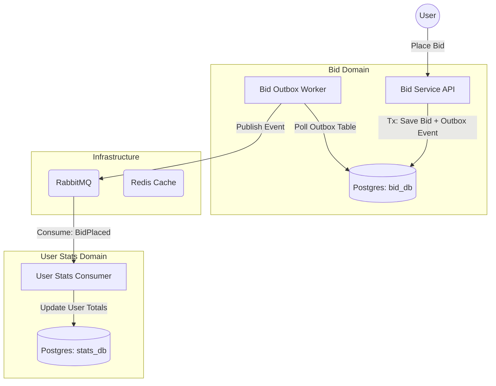

# Real-Time Auction System

A production-grade Auction System built in Go, designed to demonstrate **Event-Driven Architecture**, **Transactional Outbox Pattern**, and **Microservices** best practices.

## 🎯 Project Goals

This project serves as a practical implementation of advanced backend concepts:

-   **Transactional Outbox Pattern**: Solving the dual-write problem to ensure consistency between the Database and Message Broker.
-   **Event-Driven Architecture**: Decoupled services communicating asynchronously via RabbitMQ.
-   **Concurrency Control**: Handling race conditions in high-concurrency bidding scenarios using Postgres locking (`SELECT FOR UPDATE`).
-   **Idempotency**: Ensuring reliable event processing and data consistency in the presence of duplicate messages.
-   **Microservices Monorepo**: Managing multiple services (`bid-service`, `user-stats-service`) and shared infrastructure within a single repository.

## 🏗 Architecture

The system is split into two main domains: **Bidding** and **User Statistics**.



### Components

1.  **Bid Service (`services/bid-service`)**:
    -   **API**: Handles HTTP requests for placing bids. Implements the "write" side.
    -   **Worker**: Implements the **Outbox Relay**. It polls the `outbox_events` table and reliably publishes messages to RabbitMQ.
    -   **Database**: Stores `items`, `bids`, and `outbox_events`.

2.  **User Stats Service (`services/user-stats-service`)**:
    -   **Worker**: Consumes `BidPlaced` events from RabbitMQ.
    -   **Database**: Stores aggregated statistics (e.g., total amount spent by a user). Implements idempotency to handle duplicate events safeley.

3.  **Shared (`pkg/`)**:
    -   Common infrastructure code for Database transactions and Event publishing/consumption.

## 🚀 Getting Started

### Prerequisites

-   **Go** (1.24+)
-   **Docker** & **Docker Compose**
-   **Make**

### Local Development Setup

1.  **Start Infrastructure**
    Spin up Postgres (x2), RabbitMQ, and Redis.
    ```bash
    make up
    ```

2.  **Run Migrations**
    Apply database schemas to both `bid_db` and `stats_db`.
    ```bash
    make migrate-up-all
    ```

3.  **Run Services**
    Start all services (Bid API, Bid Worker, Stats Worker) locally.
    ```bash
    make run-all
    ```
    *Services will log to stdout with prefixes `[BID-API]`, `[WORKER]`, and `[STATS]`.*

### Building Containers

To build production-ready Docker images for all services:

```bash
make build-all
```

## 🛠 Useful Commands

| Command | Description |
|---------|-------------|
| `make up` | Start Docker infrastructure (background) |
| `make down` | Stop Docker infrastructure |
| `make run-all` | Run all Go services locally |
| `make migrate-up-all` | Run migrations for all services |
| `make test` | Run all tests (unit and integration) |
| `make test-unit` | Run unit tests only |
| `make test-integration` | Run integration tests only |
| `make proto-gen` | Regenerate Go code from Protobuf files |

