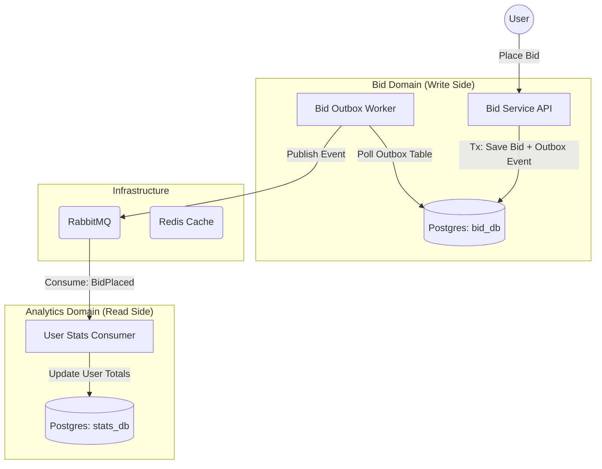

# 🔨 Gavel: High-Performance Real-Time Auction System


[](https://go.dev/)
[](https://www.postgresql.org/)
[](https://www.rabbitmq.com/)
[](https://redis.io/)

A distributed, production-ready auction platform engineered for high-concurrency bidding and data consistency. Built with Go, Postgres, and RabbitMQ, Gavel implements a robust event-driven architecture designed to handle thousands of bids per second with sub-millisecond precision.

---

## 🚀 Key Capabilities

Gavel is built to solve the complex challenges of modern auction systems:

*   **Zero-Loss Event Delivery**: Implements the **Transactional Outbox Pattern** to ensure absolute consistency between database state and message delivery.
*   **High-Concurrency Locking**: Utilizes advanced Postgres row-level locking (`SELECT FOR UPDATE`) to prevent race conditions during "sniping" scenarios.
*   **Massive Scalability**: Microservices-first design allows independent scaling of the Bid Engine and Analytics components.
*   **Strict Idempotency**: Guaranteed "at-least-once" delivery with deduplication at the consumer level, ensuring data integrity across the entire cluster.
*   **Full Observability**: Structured logging and transaction tracing across service boundaries.

---

## 🏗 Architecture

The system leverages a decoupled **Ports & Adapters (Hexagonal)** architecture, ensuring business logic remains isolated from infrastructure concerns.



---

## 🛠 Tech Stack & Patterns

-   **Language**: Go 1.24+ (Generics, Context-driven)
-   **Database**: PostgreSQL (Raw `pgx` for maximum control over transactions)
-   **Messaging**: RabbitMQ (Topic-based exchanges for decoupled scaling)
-   **Caching**: Redis (Bidding leaderboards and item metadata)
-   **Protocol**: Protobuf for high-efficiency message serialization
-   **Pattern**: Hexagonal Architecture (Clean Architecture)

---

## ⚡ Quick Start

### 1. Initialize Infrastructure
Spin up the core services (Postgres, RabbitMQ, and Redis):
```bash
make up
```

### 2. Apply Migrations
Prepare the schemas for both the Bid and Statistics databases:
```bash
make migrate-up-all
```

### 3. Launch Services
Run the API and background workers:
```bash
make run-all
```

---

## ⚙️ Development Toolkit

| Command | Action |
|:---|:---|
| `make up / down` | Control local infrastructure |
| `make test` | Run full test suite (Unit + Integration) |
| `make build-all` | Compile production binaries / Docker images |
| `make proto-gen` | Rebuild Protobuf definitions |

---

> **Note**: This system is architected for deployment in Kubernetes environments. Check the `docs/PLAN.md` for the upcoming roadmap.
